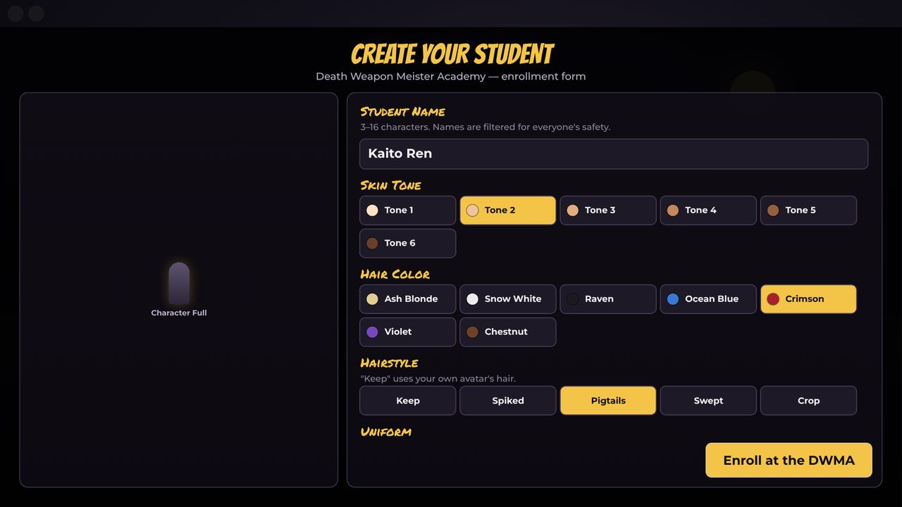
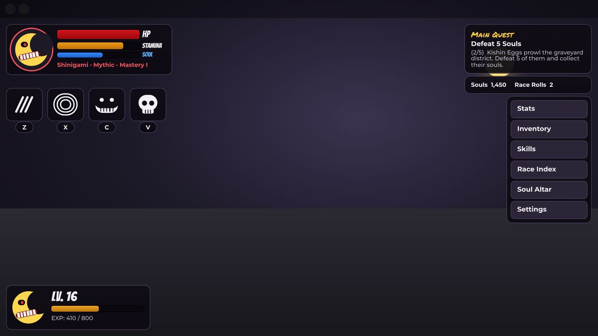
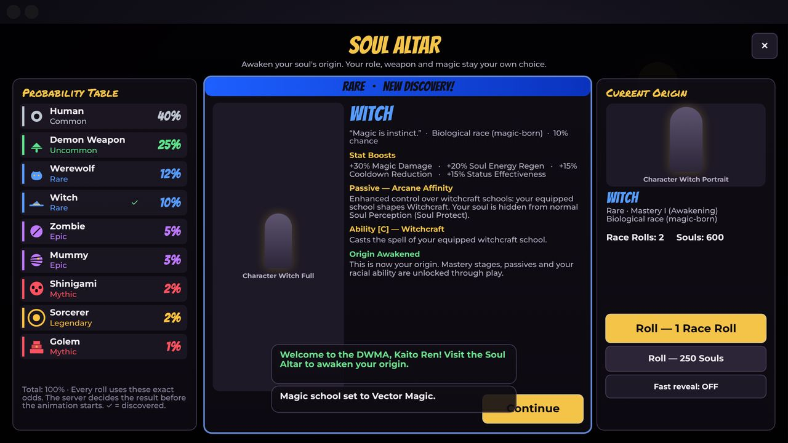
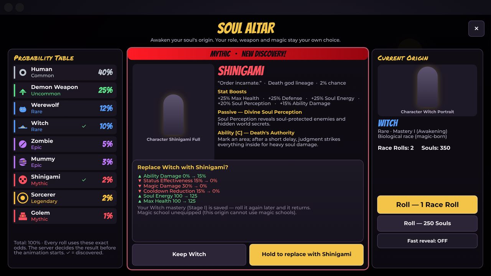
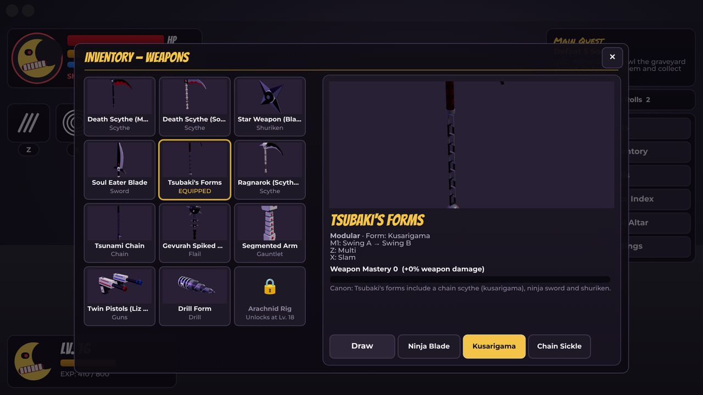
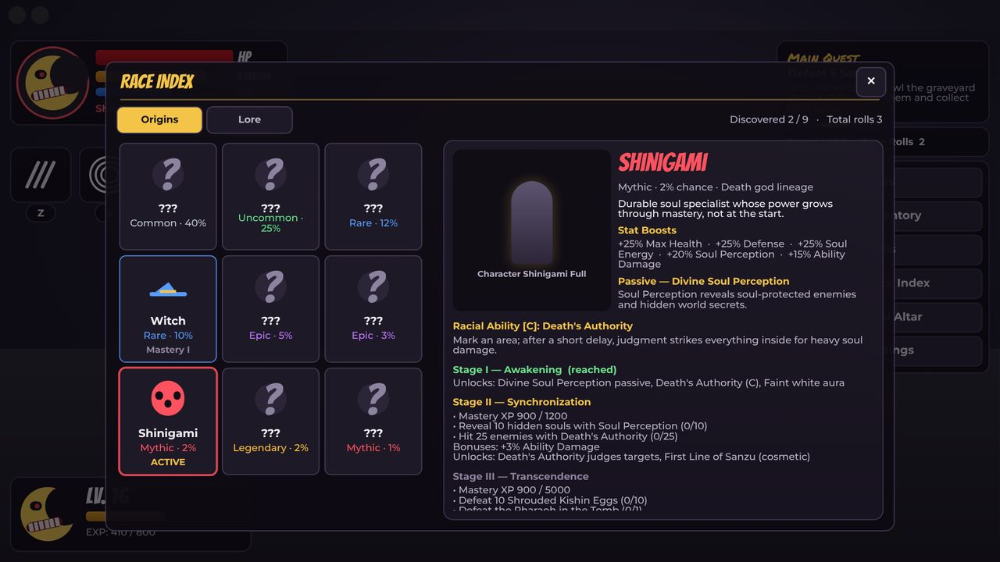

# Soul Eater RPG — Roblox

A Roblox action RPG inspired by *Soul Eater*. It combines:

- **Race rolling:** a server-authoritative origin roll with mastery progression.
- **Weapons:** 12 fully procedural 3D weapons held with real IK.
- **Effects:** physical attack VFX, with no runes or energy beams on ordinary attacks.
- **Combat and world:** server-validated combat, PvE enemies and the Death City map.
- **Interface:** a complete UI for PC, phone, tablet and gamepad.

| | |
|---|---|
|  |  |
|  |  |
|  |  |


## Quick start

- **Play it now:** open [`build/SoulEater.rbxl`](build/SoulEater.rbxl) in Roblox Studio and press **Play**.
- **Develop:** run `rojo serve default.project.json` and connect the Rojo plugin.

Full step-by-step instructions, Explorer locations and settings: **[docs/INSTALL.md](docs/INSTALL.md)**.

## What's inside

- **Races (origins):** Human 40%, Demon Weapon 25%, Werewolf 12%, Witch 10%, Zombie 5%, Mummy 3%, Sorcerer 2%, Shinigami 2%, Golem 1%.
  - Each has stat boosts, a passive and a racial ability.
  - Three mastery stages (Awakening → Synchronization → Transcendence) earned only by playing.
- **Safe rolling:**
  - The server decides the result before any animation, with a visible probability table.
  - Retries reuse their request id and are never charged twice; there's a cooldown, a rate limit and currency checks.
  - Keep/replace with a stat comparison and hold-to-confirm.
  - Saves are session-locked.
- **Independent systems:** origin, combat role (Meister is a role), weapon and magic school, kept consistent by build rules.
  - Kishin is an endgame questline, not a roll.
  - Black Blood is a status, and Madness wavelengths are an encounter mechanic.
  - Soul wavelength compatibility drives partner synchronization.
- **Balancing:** one stat pipeline (additive vs multiplicative, soft caps with diminishing returns, hard caps), and tests that keep every build inside safe limits.
- **12 weapons:**
  - built from Parts, Attachments, Trails and Motor6Ds, with grips, welds and no collision;
  - `Spawn` / `Equip` / `Unequip` / `Destroy` APIs;
  - meshes can replace any part group.
- **Animation:**
  - procedural loose walk and breathing idle for every weapon, IK hands, physical chains;
  - every clip baked into editable KeyframeSequences, and uploaded clips can replace them.
- **10 reusable VFX:** Basic Slash, Heavy Slash, Multi-Hit Combo, Chain Swing, Ground Slam, Shuriken Throw, Gun Shot, Drill Attack, Rapid Dash Slash and Weapon Impact. Pooled, quality tiers, reduced motion.
- **UI:**
  - Create Your Student, HUD, Soul Altar, Race Index (with canon vs. original lore), Stats with cap breakdowns, Skills, Inventory with 3D previews, Settings;
  - responsive layouts, touch controls, gamepad navigation, reduced motion.

## Documentation

| | |
|---|---|
| [ARCHITECTURE.md](docs/ARCHITECTURE.md) | Phase 1: Explorer hierarchy, structure changes and why, systems, stat pipeline, remotes |
| [WEAPONS.md](docs/WEAPONS.md) | Phase 2: the 12 weapon models, hierarchy, API, attachments |
| [VFX.md](docs/VFX.md) | Phase 3: the 10 effects, configuration, performance |
| [COMBAT.md](docs/COMBAT.md) | Phase 4: server authority, validation, replication, cleanup |
| [INSTALL.md](docs/INSTALL.md) | Phase 5: exact Studio installation and placeholder replacement |
| [TESTING.md](docs/TESTING.md) | Phase 6: automated tests, manual checklist, troubleshooting |
| [RACES.md](docs/RACES.md) | Origins, odds, abilities, mastery, roles, magic, balancing |
| [ANIMATION.md](docs/ANIMATION.md) | Procedural animation, baked KeyframeSequences, publishing |
| [BLENDER_WORKFLOW.md](docs/BLENDER_WORKFLOW.md) | Replacing weapon parts with your own meshes |
| [LORE.md](docs/LORE.md) | Canon vs. original interpretation, with sources |

## Development

```bash
scripts/check.sh       # types (luau-lsp), lint (selene), formatting (StyLua)
scripts/test.sh        # 114 unit/integration tests (Lune)
scripts/playtest.sh    # headless play-test: server session, all VFX, UI on 4 device profiles
scripts/render.sh      # render weapons in a character's hands
```

All asset ids are placeholders (`rbxassetid://0`) until you add your own. Nothing depends on uploaded assets.

---

*Soul Eater* © Atsushi Ohkubo / Square Enix. This is an unofficial fan project; see [LORE.md](docs/LORE.md) for what is canon and what is original.
