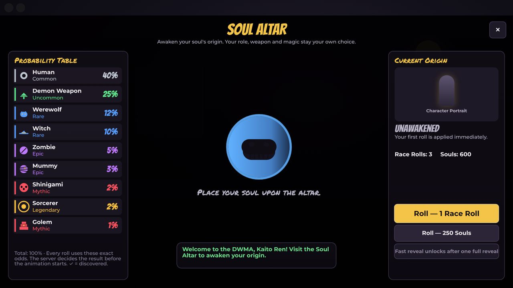

# Race rolling and progression

## Origins and odds

Weights are stored as exact basis points: `RaceConfig` weights sum to **10000 = 100%**, and a unit test enforces that. If you add a race, rebalance the whole table; never silently change one entry. A chi-square test over 1,000,000 server rolls checks that the real distribution matches the table.

| Race | Rarity | Chance | Classification | Stat boosts | Passive | Ability [C] |
|---|---|---|---|---|---|---|
| Human | Common | 40% | Biological race | +10% XP Gain, +10% Soul Perception, +5% Stamina Regen, +5% Weapon Mastery Gain | **Adaptive Potential** — Gain an additional 5% weapon mastery experience. Mastery stages add small bonuses across many stats instead of one. | Adaptive Focus (Mastery II) |
| Demon Weapon | Uncommon | 25% | Human lineage with weapon transformation | +20% Weapon Damage, +15% Weapon Mastery Gain, +10% Attack Speed | **Weapon Resonance** — While synchronized with a compatible Meister partner nearby, deal more damage and spend less Soul Energy. Compatibility depends on both souls' wavelengths. | Resonance Surge |
| Werewolf | Rare | 12% | Biological race | +25% Move Speed, +20% Melee Damage, +15% Attack Speed, +10% Dodge Distance | **Predator Instinct** — Nearby enemies are tracked: wounded enemies inside your Soul Perception range are outlined. | Beast Shift |
| Witch | Rare | 10% | Biological race (magic-born) | +30% Magic Damage, +20% Soul Energy Regen, +15% Cooldown Reduction, +15% Status Effectiveness | **Arcane Affinity** — Enhanced control over witchcraft schools: your equipped school shapes Witchcraft. Your soul is hidden from normal Soul Perception (Soul Protect). | Witchcraft |
| Zombie | Epic | 5% | Revived undead (not born) | +25% Max Health, +20% Defense, +15% Health Regen, +20% Poison Resistance | **Undying Persistence** — Once every 180s, a lethal hit leaves you at 1 HP with 1.5s of protection — only if you were above 25% health before the hit. | Gravebound Recovery |
| Mummy | Epic | 3% | Preserved undead (not born) | +30% Defense, +20% Max Health, +25% Status Resistance, +15% Soul Energy, +15% Ranged Damage Reduction, -10% Move Speed | **Ancient Wrappings** — Take 15% less damage from projectiles and gunfire. | Binding Curse |
| Sorcerer | Legendary | 2% | Human practitioner of sorcery (a lineage, not a species) | +35% Magic Damage, +25% Soul Energy, +20% Cooldown Reduction, +20% Soul Energy Regen | **Arcane Mastery** — Abilities cast within 3s of another ability cost 15% less Soul Energy (magical combos). | Sorcery Specialization |
| Shinigami | Mythic | 2% | Death god lineage | +25% Max Health, +25% Defense, +25% Soul Energy, +20% Soul Perception, +15% Ability Damage | **Divine Soul Perception** — Soul Perception reveals soul-protected enemies and hidden world secrets. | Death's Authority |
| Golem | Mythic | 1% | Soul bound to a crafted body (not a biological race) | +50% Max Health, +35% Defense, +25% Knockback Resistance, +20% Charged Damage, -15% Move Speed, +50% Interrupt Resistance | **Living Fortress** — Incoming hits interrupt you for half as long. | Colossus Slam |

These are custom game-balance values, not official statistics. The `Classification` column makes clear which origins are not biological species (undead, constructs, lineages). Canon notes are in [LORE.md](LORE.md).

### Racial abilities [C]

- **Human — Adaptive Focus** (20 SE, 30s): Refill half your stamina, cleanse status effects and gain +10% damage for 6s.
- **Demon Weapon — Resonance Surge** (15 SE, 20s): Requires a full Resonance meter (built by landing weapon hits). Weapon attacks deal +15% damage and swing 10% faster for 8s.
- **Werewolf — Beast Shift** (25 SE, 45s): For 7s: +12% move speed, +10% melee damage, +10% attack speed and longer dodges.
- **Witch — Witchcraft** (30 SE, 12s): Casts the spell of your equipped witchcraft school.
- **Zombie — Gravebound Recovery** (25 SE, 50s): Heal 30% of Max Health over 3s while taking 15% less damage.
- **Mummy — Binding Curse** (25 SE, 16s): Hurl cursed wrappings that root the first enemy hit (players 0.9s, enemies 1.5s, bosses are slowed instead). _Drawback: -10% movement speed_
- **Sorcerer — Sorcery Specialization** (35 SE, 10s): Casts the technique of your equipped sorcery school.
- **Shinigami — Death's Authority** (60 SE, 75s): Mark an area; after a short delay, judgment strikes everything inside for heavy soul damage.
- **Golem — Colossus Slam** (30 SE, 20s): Plant yourself and wind up (visible to everyone), then slam the ground in a wide area. _Drawback: -15% movement speed; slow, visible wind-ups_

## Rolling safely (server-authoritative)

1. **The server decides first.** `RaceService` uses a server-owned `Random` to roll *before* the client animates anything. The client only ever animates a result it has already been told.
2. **Idempotent requests.** Every roll carries a request id (a GUID) that is remembered in the saved profile. A retry, double-click or reconnect with the same id replays the same result, so a roll is **never charged twice**. The client retries network failures with the same id.
3. **Validated every time:** currency (1 Race Roll or 250 Souls), student created, pending choice, a 1 s cooldown on the server clock, a per-player busy lock and the `RemoteGuard` rate limit.
4. **Keep or replace.** Rolling a different race while you have one creates a *pending choice*, saved in the profile, that blocks further rolls until you decide. If your current race is invested (any mastery XP or stage), replacing it requires **press-and-hold**, with a stat comparison shown first.
5. **Mastery is never lost.** Progress is stored per race. If you replace a race and roll it again later, all its progress returns.
6. **Duplicates.** Rolling your current race grants a *Soul Echo* (+100 mastery XP) instead of a reroll.
7. **Persistence.** Purchases save immediately through a session-locked DataStore: a profile can't be loaded on two servers at once, so nothing can be duplicated.

## Roll screen (Soul Altar)

| Screen | |
|---|---|
|  |  |

- **Odds:** the full probability table (exact percentages, ✓ for discovered races) is visible before every roll.
- **Reveal:** an escalating soul-orb build-up climbs through the rarity colors to the result's tier, followed by a burst and the reveal card. Epic and higher get a tinted flash, kept under 40% opacity and never strobing.
- **Fast reveal:** after you have watched one full reveal, a *Skip* button and a *Fast reveal* setting unlock.
- **Reduced motion:** a short crossfade replaces the pulses, burst and flash.
- **Small screens:** phones get a compact layout.
- **Announcements:** Legendary and Mythic pulls are announced server-wide after the reveal.

## Race Index (collection)

- **Collection:** every race is listed with its rarity and exact chance. Undiscovered races show a silhouette, but their odds and boosts are never hidden.
- **Detail pane:** passive, ability (with its unlock stage) and drawback.
- **Mastery:** all three stages, with XP and objective progress from the saved profile.
- **Lore tab:** canon vs. game interpretation for every origin and system.

## Mastery: Awakening → Synchronization → Transcendence

Stage II needs **1200 mastery XP** and Stage III **5000**, and each also requires that stage's objectives. Mastery XP comes only from playing (kills 25, bosses 300, quests 150, ability hits 4, weapon hits 1). It can't be bought, and buying more rolls doesn't speed it up. Stage bonuses are deliberately small (2–5%). Transcendence is about ability variants, auras and prestige titles rather than raw power.

- **Human** — II Synchronization: 1200 XP + Defeat 40 enemies; Land 150 weapon hits → +5% Weapon Mastery Gain, +5% Stamina Regen | III Transcendence: 5000 XP + Defeat 150 enemies; Defeat the Pharaoh in the Tomb → +5% XP Gain, +4% Weapon Damage, +4% Magic Damage, +4% Max Health, +4% Defense · title “Unbound Soul”
- **Demon Weapon** — II Synchronization: 1200 XP + Activate Resonance Surge 8 times; Land 100 weapon hits during Resonance Surge → +3% Weapon Damage | III Transcendence: 5000 XP + Defeat 25 enemies while synchronized or surging; Defeat the Pharaoh in the Tomb → +3% Weapon Damage, +3% Attack Speed · title “Death Scythe Candidate”
- **Werewolf** — II Synchronization: 1200 XP + Activate Beast Shift 8 times; Land 120 melee hits → +3% Melee Damage | III Transcendence: 5000 XP + Defeat 30 enemies during Beast Shift; Defeat the Pharaoh in the Tomb → +2% Move Speed, +3% Melee Damage · title “Alpha of the Night”
- **Witch** — II Synchronization: 1200 XP + Cast Witchcraft 25 times; Apply 20 status effects → +3% Magic Damage | III Transcendence: 5000 XP + Defeat 40 enemies with magic; Defeat the Pharaoh in the Tomb → +3% Magic Damage, +5% Soul Energy Regen · title “Coven Luminary”
- **Zombie** — II Synchronization: 1200 XP + Recover 3,000 health; Trigger Undying Persistence 2 times → +5% Health Regen | III Transcendence: 5000 XP + Take 15,000 damage; Defeat the Pharaoh in the Tomb → +4% Max Health, +5% Poison Resistance · title “The Unburied”
- **Mummy** — II Synchronization: 1200 XP + Bind 20 enemies with Binding Curse; Take 2,000 ranged damage → +3% Status Resistance | III Transcendence: 5000 XP + Bind 60 enemies with Binding Curse; Defeat the Pharaoh in the Tomb → +4% Defense, +3% Move Speed · title “Keeper of the Tomb”
- **Sorcerer** — II Synchronization: 1200 XP + Cast Sorcery 30 times; Deal 8,000 magic damage → +5% Soul Energy | III Transcendence: 5000 XP + Deal 30,000 magic damage; Defeat the Pharaoh in the Tomb → +3% Magic Damage, +2% Cooldown Reduction · title “Archsorcerer”
- **Shinigami** — II Synchronization: 1200 XP + Reveal 10 hidden souls with Soul Perception; Hit 25 enemies with Death's Authority → +3% Ability Damage | III Transcendence: 5000 XP + Defeat 10 Shrouded Kishin Eggs; Defeat the Pharaoh in the Tomb → +3% Ability Damage, +5% Soul Energy · title “Reaper of Order”
- **Golem** — II Synchronization: 1200 XP + Hit 30 enemies with Colossus Slam; Absorb 5,000 damage → +3% Charged Damage | III Transcendence: 5000 XP + Hit 100 enemies with Colossus Slam; Defeat the Pharaoh in the Tomb → +5% Knockback Resistance, +3% Charged Damage, +3% Move Speed · title “Living Citadel”

## Combat roles (not races) and magic schools

| Role | What it does | Technique [V] |
|---|---|---|
| Meister | Weapon handler. Improved weapon mastery and synchronization with a Demon Weapon partner. | Wavelength Strike (30 SE, 14s) |
| Assassin | Mobility and burst. Closes gaps and punishes from behind. | Shadow Step (20 SE, 12s) |
| Wavelength Technician | Soul wavelength specialist. Stronger abilities and faster Soul Energy recovery. | Soul Pulse (30 SE, 15s) |
| Partner Weapon | Demon Weapons only. Fights with partial transformations of their own body. | Partial Transformation (25 SE, 25s) |

| School | Origin | Unlock | Effect |
|---|---|---|---|
| Vector Magic | Witch | Lv 1 | Arrow-shaped force projectiles that seek their target. |
| Frog Magic | Witch | Lv 8 | Explosive tadpole familiars that burst on impact. |
| Restoration Magic | Witch | Lv 15 | Rare regenerative witchcraft that heals allies. |
| Ember Sorcery | Sorcerer | Lv 1 | Controlled flame that leaves lingering burns. |
| Void Sorcery | Sorcerer | Lv 8 | Collapses space into a short-lived gravity well. |
| Demon Tool Artifice | Sorcerer | Lv 15 | Assembles a temporary construct that fights beside you. |

Build rules: a Demon Weapon can't take the Meister role (it uses Partner Weapon or Technician), and only Witch and Sorcerer origins can equip a magic school. When an origin changes, the build is re-checked automatically and the player is told what changed.

## Balancing

All modifiers go through one place, `Core/StatCalculator`:

- **Additive vs multiplicative.** Additive bonuses (race, mastery, role, weapon mastery) are *summed* per stat. Multiplicative bonuses (timed buffs) are multiplied separately.
- **Soft and hard caps.** Above a stat's soft cap only 50% of any further bonus counts (diminishing returns), and nothing passes the hard cap. A final absolute clamp protects movement speed and similar values.
- **Damage pools.** Additive damage bonuses share one pool (soft 60%, hard 100%). Multiplicative buffs are capped at ×1.4, and any single hit at ×2.6 in total.
- **Defense** converts to damage reduction with a level-scaled curve, capped at 60%.
- **Common stays viable.** Humans have no drawbacks, earn XP and mastery faster, and their Transcendence spreads bonuses across many stats. Rare races carry real drawbacks: Mummy −10% move speed, Golem −15% move speed and slow, telegraphed attacks. A test checks every race × role × full mastery combination at levels 1/15/30/50 against all caps, and prints an effective-power table for tuning.

| Stat | Category | Kind | Soft cap | Hard cap |
|---|---|---|---|---|
| Max Health | Survival | Scalar | 60% | 90% |
| Defense | Survival | Scalar | 50% | 85% |
| Health Regen | Survival | Scalar | 25% | 50% |
| Status Resistance | Survival | Percent | 35% | 60% |
| Poison Resistance | Survival | Percent | 40% | 75% |
| Knockback Resistance | Survival | Percent | 40% | 80% |
| Interrupt Resistance | Survival | Percent | 40% | 70% |
| Ranged Damage Reduction | Survival | Percent | 15% | 30% |
| Weapon Damage | Offense | Percent | 40% | 75% |
| Melee Damage | Offense | Percent | 40% | 75% |
| Magic Damage | Offense | Percent | 45% | 80% |
| Charged Damage | Offense | Percent | 40% | 70% |
| Ability Damage | Offense | Percent | 35% | 60% |
| Attack Speed | Offense | Scalar | 25% | 40% |
| Status Effectiveness | Offense | Percent | 30% | 50% |
| Cooldown Reduction | Offense | Percent | 25% | 40% |
| Move Speed | Mobility | Scalar | 20% | 30% |
| Dodge Distance | Mobility | Scalar | 20% | 35% |
| Max Stamina | Mobility | Scalar | 30% | 50% |
| Stamina Regen | Mobility | Scalar | 20% | 35% |
| Soul Energy | Soul | Scalar | 30% | 50% |
| Soul Energy Regen | Soul | Scalar | 25% | 40% |
| Soul Perception | Soul | Scalar | 30% | 50% |
| XP Gain | Progression | Percent | 50% | 100% |
| Weapon Mastery Gain | Progression | Percent | 40% | 80% |

## Lore-sensitive systems (not rolls)

- **Kishin:** an endgame questline (*Whispers of Madness* → *Black Blood* → *The Kishin's Path*, level 20–30). It unlocks *Kishin Awakening* [B], a 15 s risky burst fueled by Madness that drains your health. You never become a Kishin.
- **Black Blood:** a quest-unlocked status. Below 40% health your blood hardens (+30% Defense for 5 s, 30 s cooldown) at the cost of Madness.
- **Madness wavelengths:** Madness Wraiths raise a 0–100 meter. At 50+ you deal more damage but also take more; it decays once you leave the wavelength.
- **Soul wavelength compatibility:** chosen at student creation (Calm, Fierce, Precise, Gentle, Wild). A Demon Weapon and a Meister can synchronize, and compatibility (50–100%) scales the bonus.
- **Meister specialization:** the Meister role improves weapon mastery and enables Soul Resonance with a partner.
