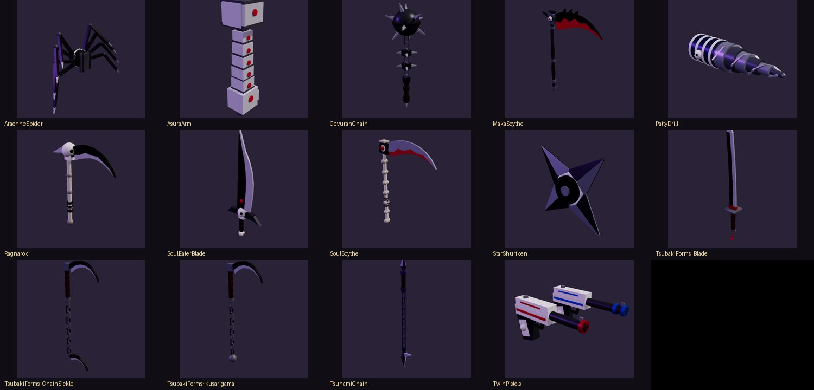
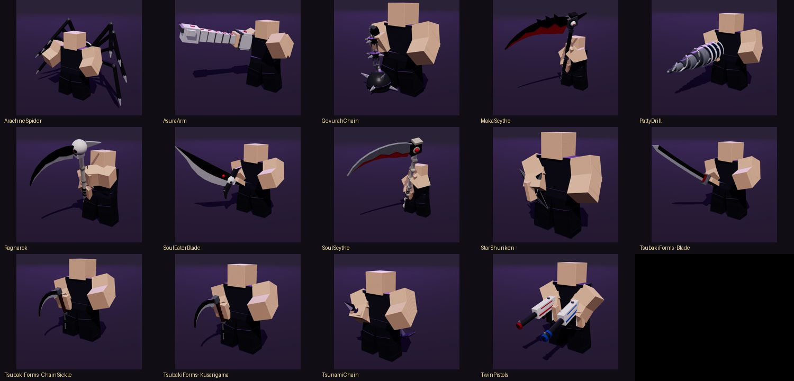
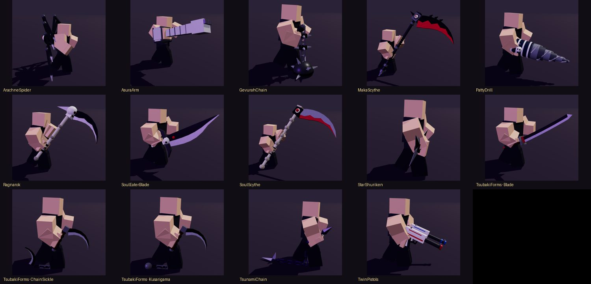
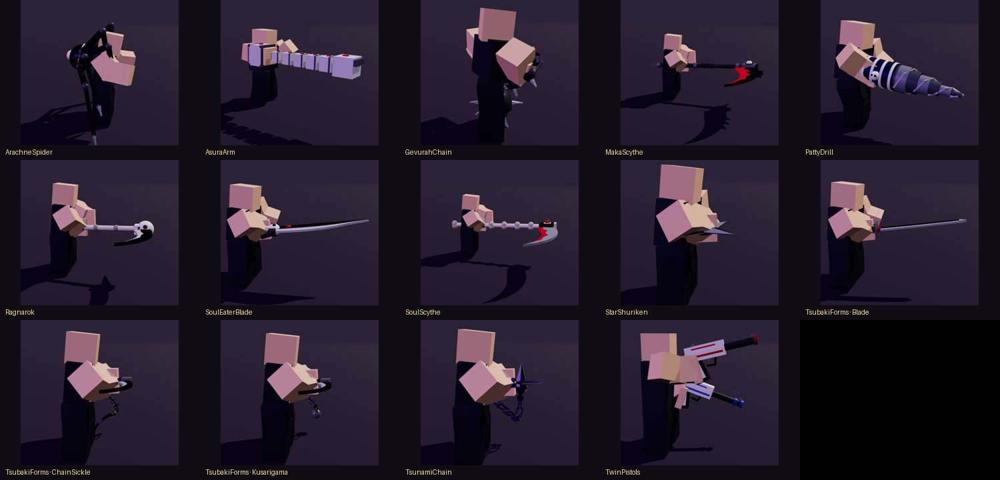

# Weapons (Phase 2)



All 12 weapons are **real 3D models** built from Parts, WedgeParts, Attachments, Trails and Motor6Ds by Luau code (`WeaponBuilder/Models/*`). No meshes or uploads are needed. Each one is built from its dimensions and palette in `WeaponConfig`, so size and colors are plain config values. You can swap any part group for your own mesh later ([BLENDER_WORKFLOW.md](BLENDER_WORKFLOW.md)).

| Weapon | Category | Hold style | Unlock | Parts | M1 combo | Z | X | Impact |
|---|---|---|---|---|---|---|---|---|
| Death Scythe (Maka) | Scythe | ScytheTwoHand | Lv 1 | 106 | Scythe_SlashA → Scythe_SlashB → Scythe_SlashC | Scythe_Heavy (HeavySlash) | Scythe_DashSlash (RapidDashSlash) | Blade |
| Death Scythe (Soul) | Scythe | ScytheTwoHand | Lv 6 | 92 | Scythe_SlashA → Scythe_SlashB → Scythe_SlashC | Scythe_Heavy (HeavySlash) | Scythe_GroundSlam (GroundSlam) | Blade |
| Star Weapon (Black☆Star) | Shuriken | ShurikenHold | Lv 1 | 47 | Star_SlashA → Star_SlashB | Star_Throw (ShurikenThrow) | Star_MultiThrow (ShurikenThrow) | Blade |
| Soul Eater Blade | Sword | SwordOneHand | Lv 1 | 75 | Sword_SlashA → Sword_SlashB → Sword_SlashC | Sword_MultiHit (MultiHitCombo) | Sword_DashSlash (RapidDashSlash) | Blade |
| Tsubaki's Forms — Ninja Blade | Modular | SwordOneHand | Lv 4 | 70 | Sword_SlashA → Sword_SlashB → Sword_SlashC | Sword_Heavy (HeavySlash) | Sword_DashSlash (RapidDashSlash) | Blade |
| Tsubaki's Forms — Kusarigama | Modular | Kusarigama | Lv 4 | 95 | Chain_SwingA → Chain_SwingB | Chain_Multi (MultiHitCombo) | Chain_Slam (GroundSlam) | Chain |
| Tsubaki's Forms — Chain Sickle | Modular | Kusarigama | Lv 4 | 137 | Chain_SwingA → Chain_SwingB | Chain_Multi (MultiHitCombo) | Sword_DashSlash (RapidDashSlash) | Chain |
| Ragnarok (Scythe Form) | Scythe | CompactScythe | Lv 10 | 76 | Scythe_SlashA → Scythe_SlashB | Scythe_Heavy (HeavySlash) | Sword_MultiHit (MultiHitCombo) | Blade |
| Tsunami Chain | Chain | ChainWeapon | Lv 8 | 84 | Chain_SwingA → Chain_SwingB | Chain_Multi (MultiHitCombo) | Chain_Slam (GroundSlam) | Chain |
| Gevurah Spiked Chain | Flail | HeavyFlail | Lv 14 | 112 | Flail_Swing → Flail_SwingB | Flail_Slam (GroundSlam) | Chain_Multi (MultiHitCombo) | Heavy |
| Segmented Arm | Gauntlet | ArmWeapon | Lv 12 | 35 | Arm_PunchA → Arm_PunchB → Arm_PunchC | Arm_Slam (GroundSlam) | Arm_DashPunch (RapidDashSlash) | Heavy |
| Twin Pistols (Liz & Patty) | Guns | DualPistols | Lv 1 | 41 | Gun_ShotR → Gun_ShotL | Gun_Rapid (GunShot) | Gun_Charged (GunShot) | Gun |
| Drill Form | Drill | DrillArm | Lv 16 | 36 | Drill_Thrust | Drill_Grind (DrillAttack) | Drill_Dash (RapidDashSlash) | Heavy |
| Arachnid Rig | Rig | SpiderBack | Lv 18 | 86 | Spider_StrikeA → Spider_StrikeB | Spider_Sweep (HeavySlash) | Spider_Slam (GroundSlam) | Blade |

*Parts* is the real part count of each model. A test keeps every weapon between 20 and 160 parts, so twenty armed players stay cheap. Tsubaki's three forms are one weapon with switchable models: press T, or use the Inventory.

## Model hierarchy

```
Model "EquippedWeapon"             PrimaryPart = first unit's Handle
└─ Model <Unit>                    "Main", or "Liz"/"Patty" for the twin pistols
   ├─ Part "Handle"                PrimaryPart of the unit; invisible; origin = grip point
   │  ├─ Attachment "Grip"         where the hand holds (identity = model origin)
   │  ├─ Attachment "SupportGrip"  second hand on two-handed weapons
   │  ├─ Attachment "TrailA"/"TrailB" + Trail "SlashTrail"   (enabled only during swings)
   │  ├─ Attachment "Impact"       main contact point (tip / head)
   │  ├─ Attachment "Muzzle"       guns only
   │  └─ Motor6D "MountJoint"      joins the Handle to the hand / forearm / back
   └─ Model "Shaft" / "Blade" / "Chain" / "Bit" / …   named part groups, each part welded to the
                                                     Handle, or Motor6D-jointed if it moves
                                                     (chain links, drill bit, pistol slide,
                                                      spider legs, arm segments)
```

Model-space convention, in studs relative to the grip:

- **+Y** runs along the handle toward the business end, so the blade sits above the fist.
- **−Z** is the facing / edge side; barrels point −Z.
- **X** is the thickness of flat blades.

This matches Roblox's `RightGripAttachment`: blades held up and guns aimed forward line up with no extra rotation.

**Collision:** every weapon part has `CanCollide`, `CanTouch` and `CanQuery` set to false and `Massless` set to true. Weapons never push players, never trigger touches, and never get in the way of hit detection. Hits are decided by the server's geometric queries in `CombatService`.

## API (`ReplicatedStorage.Modules.WeaponBuilder`)

```lua
local WeaponBuilder = require(ReplicatedStorage.Modules.WeaponBuilder)

-- Build a model (not parented). Options: Origin (CFrame), Anchored, Form (Tsubaki), Scale, Palette overrides
local model, units = WeaponBuilder.Build("MakaScythe", { Origin = CFrame.new(0, 5, 0), Anchored = true })

-- Spawn an anchored display copy in the world (used by the weapon rack)
local display = WeaponBuilder.Spawn("TwinPistols", CFrame.new(10, 3, 0), workspace)

-- Equip on a character (R15; R6 falls back to arm/torso parts). Replaces any equipped weapon.
local equipped = WeaponBuilder.Equip(character, "TsubakiForms", { Form = "Kusarigama", Drawn = true })

WeaponBuilder.SetDrawn(character, false)    -- holster on the back (category-specific offsets)
WeaponBuilder.GetEquipped(character)        -- the "EquippedWeapon" model or nil
WeaponBuilder.Unequip(character)            -- removes it and clears the character attributes
WeaponBuilder.Destroy(model)                -- safe destroy of any built model
WeaponBuilder.CountParts(model)
```

Equipping sets these character attributes: `EquippedWeapon`, `WeaponForm`, `WeaponDrawn`, `HoldStyle` and `ImpactType`. Animation and VFX read them, so they work on every client without extra remotes. On the server, `WeaponService` owns all equipping and holstering, so every player sees the same model.

## In the hands

| Idle | Walk | Mid-attack |
|---|---|---|
|  |  |  |

Hands are placed by two-bone IK onto `Grip` and `SupportGrip` every frame. If an animation asks for more reach than an R15 arm has, the weapon slides back into reach (keeping its angle), so it never floats away from the fist. A test checks hand-on-grip for every weapon in idle, walk, run and every attack frame.

## Adding a weapon

1. Add an entry to `WeaponConfig.Weapons` and to `WeaponConfig.Order`, with dimensions, palette, `HoldStyle`, `Moveset`, `Trail`, `Sounds` and `AnimationIds` placeholders.
2. Add `WeaponBuilder/Models/<Builder>.luau`. It returns `function(api)` and builds with `GeometryKit` (Block, Cylinder, Triangle, Strip, Spike, Ring, Attachment, Motor). Put `TrailA`/`TrailB`, `Impact` and, if two-handed, `SupportGrip`.
3. Pick or add a hold style in `AnimationLibrary.Holds`.
4. Run `scripts/test.sh`: the weapon specs check hierarchy, welds, collision flags, the part budget and IK reach.
5. Run `lune run tools/export_animations.luau <Id>` to bake its animation saves.
